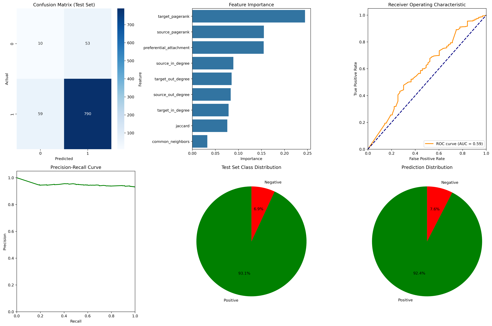
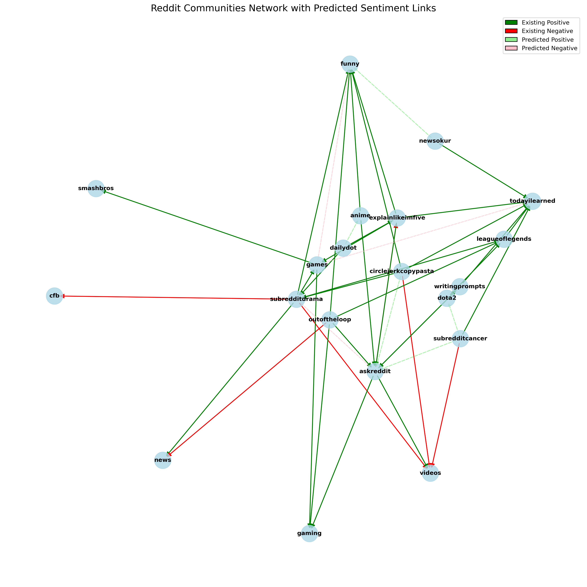
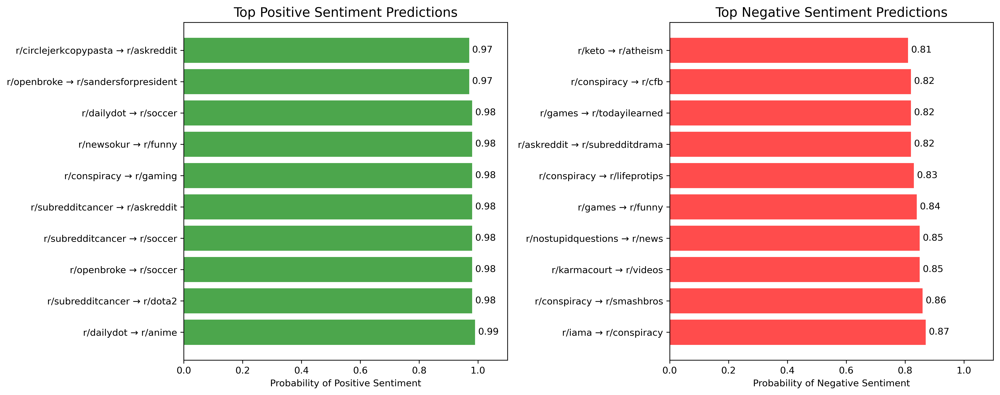

# Reddit Community Sentiment Analysis

This project analyzes Reddit community interactions and predicts sentiment between subreddits based on network features. It uses machine learning to understand existing community relationships and predict potential future interactions.

## Overview

This analysis examines hyperlinks between subreddits and their associated sentiment using network analysis and machine learning techniques. The model identifies patterns in how communities interact and predicts sentiment for communities that haven't yet interacted.

## Features

- **Network Analysis**: Creates a directed graph with subreddits as nodes and hyperlinks as edges
- **Feature Engineering**: Extracts graph-based features such as PageRank, degree centrality, and community structure
- **Machine Learning**: Uses balanced Random Forest classification to predict sentiment
- **Class Imbalance Handling**: Implements SMOTE oversampling and undersampling techniques
- **Validation**: Proper cross-validation and holdout test set for robust evaluation
- **Visualization**: Comprehensive visualizations of model performance and network structure

## Dataset

The model uses the "Reddit Hyperlink Network" dataset which contains timestamped hyperlinks between subreddits from 2014-2017, along with sentiment labels.

- Source: [SNAP Stanford Network Analysis Project](https://snap.stanford.edu/data/soc-RedditHyperlinks.html)
- Format: TSV file with hyperlink information and sentiment scores

## Requirements

- Python 3.6+
- pandas
- numpy
- networkx
- matplotlib
- seaborn
- scikit-learn
- imbalanced-learn

## Usage

```bash
python reddit_analysis.py /path/to/soc-redditHyperlinks-body.tsv [balance_strategy]
```

Where:
- `balance_strategy` is optional and can be 'oversample', 'undersample', or 'combined' (default)

## Results

The model achieves approximately 88% accuracy on the holdout test set, with significantly better performance on positive sentiment prediction. Key findings include:

1. Most subreddit interactions are positive (93% in the test set)
2. Target PageRank is the most important feature for sentiment prediction
3. The model identified interesting potential positive and negative relationships between communities that haven't yet interacted

See the [Insights](INSIGHTS.md) file for a deeper discussion of results and applications.

## Visualizations

### Model Performance


### Reddit Communities Network


### Top Predictions


## Limitations

- Class imbalance remains a challenge (93% positive interactions in dataset)
- Limited to hyperlink interactions only (doesn't capture other forms of interaction)
- Temporal aspects not fully captured in current model


